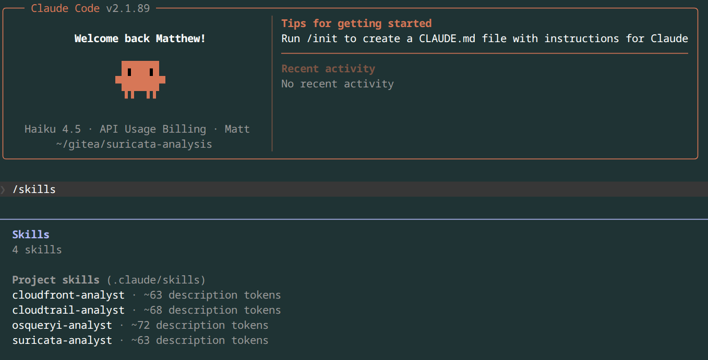
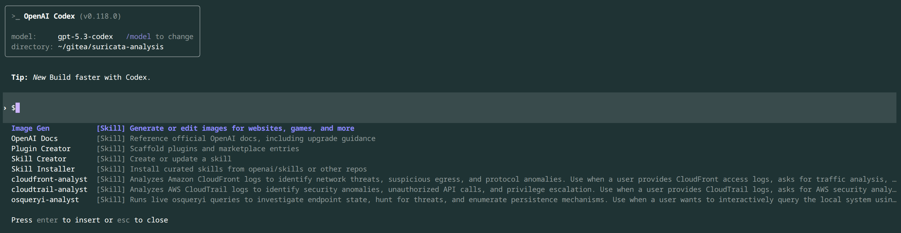
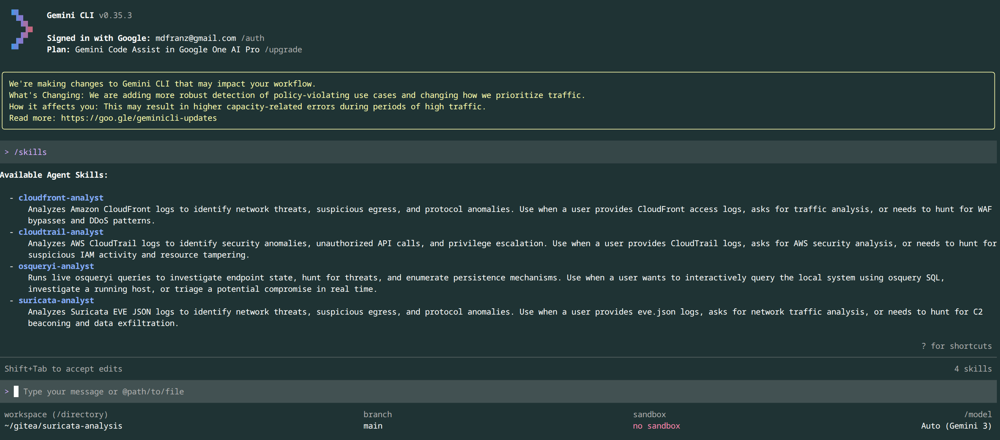
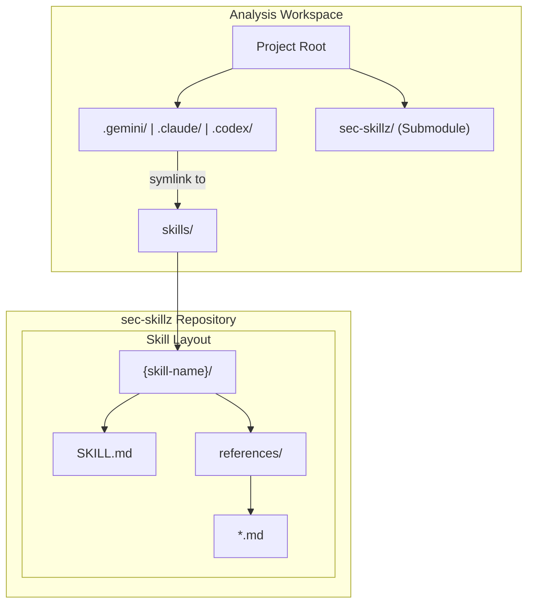

# Security Skillz

A collection of specialized agent skills for security analysis. These are designed to work across Claude Code, Gemini CLI, and Codx





## Architecture

The repository follows a modular structure where skills are maintained in this repo (`sec-skillz`) and can be integrated into any analysis workspace as a submodule.



## Assumptions

There is a separation of your `workspace` (a git repo where you are doing analysis) from the your `skill repo`

Your workspace has your data and report artifacts and tools developed by the skills where you iterate with multiple coding CLIs.

Add submodule for skills repo

```
git submodule add git@github.com:mdfranz/sec-skillz.git sec-skillz
```

Create directories

```
mkdir -p .gemini .codex .claude
```

Create symlinks to skill dirs for each

```
ln -s ../sec-skillz/skills .claude/skills
ln -s ../sec-skillz/skills .gemini/skills
ln -s ../sec-skillz/skills .codex/skills
```

## Available Skills

### CloudFront Analyst
**Location:** `skills/cloudfront-analyst/`  
**Description:** Analyzes Amazon CloudFront logs using Python, DuckDB, and polars to identify network threats, suspicious egress, and protocol anomalies.

### CloudTrail Analyst
**Location:** `skills/cloudtrail-analyst/`  
**Description:** Analyzes AWS CloudTrail logs using Python, DuckDB, and jq to identify security anomalies, unauthorized API calls, and privilege escalation.

### osqueryi Analyst
**Location:** `skills/osqueryi-analyst/`  
**Description:** Runs live osqueryi queries using Python, DuckDB, and polars to investigate endpoint state, hunt for threats, and enumerate persistence mechanisms.

### Suricata Analyst
**Location:** `skills/suricata-analyst/`  
**Description:** Analyzes Suricata EVE JSON logs using Python, DuckDB, polars, and jq to identify network threats, suspicious egress, and protocol anomalies.

# References
See the following reference

- [Agent Skills](https://agentskills.io/home) and [spec](https://agentskills.io/specification)
- [Creating Agent Skills](https://geminicli.com/docs/cli/creating-skills/) and [Extend Claude with Skills](https://code.claude.com/docs/en/skills)
- [Beyond Prompt Engineering: Using Agent Skills in Gemini CLI](https://medium.com/google-cloud/beyond-prompt-engineering-using-agent-skills-in-gemini-cli-04d9af3cda21) 
- [Gemini CLI Adds Agent Skills And Your Terminal Starts Acting Like An Agent Runtime](https://medium.com/the-context-layer/gemini-cli-adds-agent-skills-and-your-terminal-starts-acting-like-an-agent-runtime-63a5d9cb0371)
- [The Complete Guide to Building Skills for Claude](https://resources.anthropic.com/hubfs/The-Complete-Guide-to-Building-Skill-for-Claude.pdf?hsLang=en)
